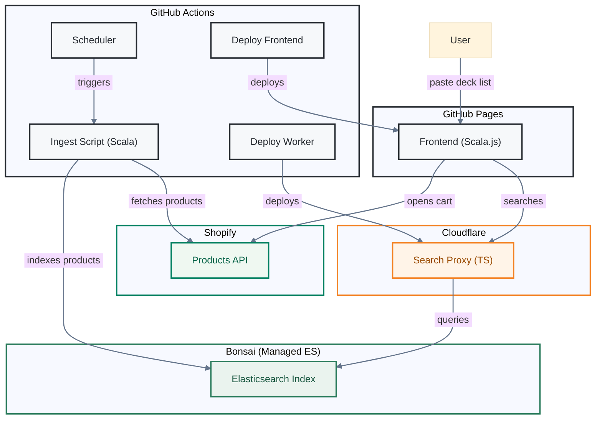
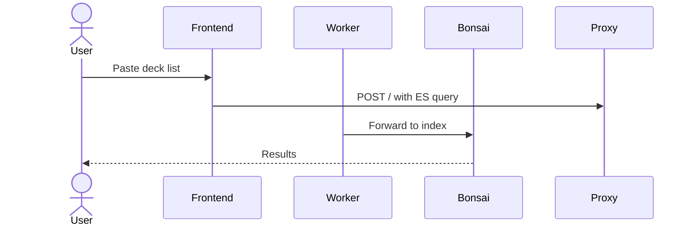
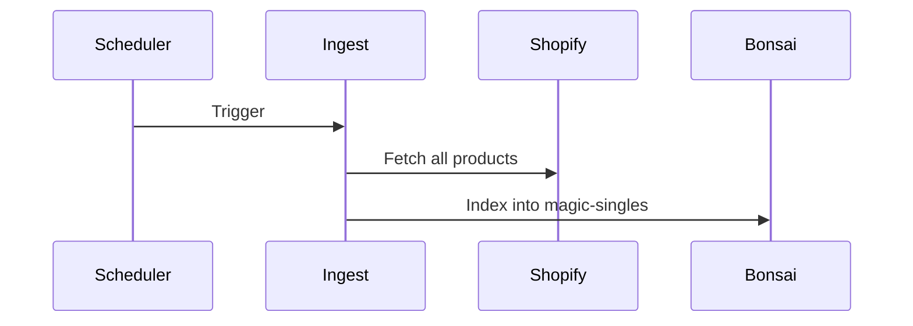

# Screen Free MTG Search

A better interface for searching Magic: The Gathering singles from [Screen Free Games](https://screenfreegames.com/collections/magic-singles), a local hobby store.

This project is not affiliated with Screen Free Games. It interfaces with their public Shopify API and does not handle purchases or payments. After selecting cards, the interface redirects to the store's Shopify cart with your selection.

https://chua-mbt.github.io/screenfree-magic-singles/

## Build

### Frontend

Requires sbt and Java 21.

```sh
sbt deckbuilder/fullLinkJS
```

The compiled output is at `deckbuilder/target/scala-3.3.3/deckbuilder-opt/`. To test locally:

```sh
npx serve deckbuilder/target/scala-3.3.3/deckbuilder-opt
```

### Search Proxy

Requires Node.js.

```sh
cd search-proxy
npm install
npm run typecheck
npm run dev
```

### Ingest

Requires sbt and Java 21.

```sh
BONSAI_URL=<url> sbt screen-free-ingest/run
```

## Architecture



## Search Request



## Product Ingestion


